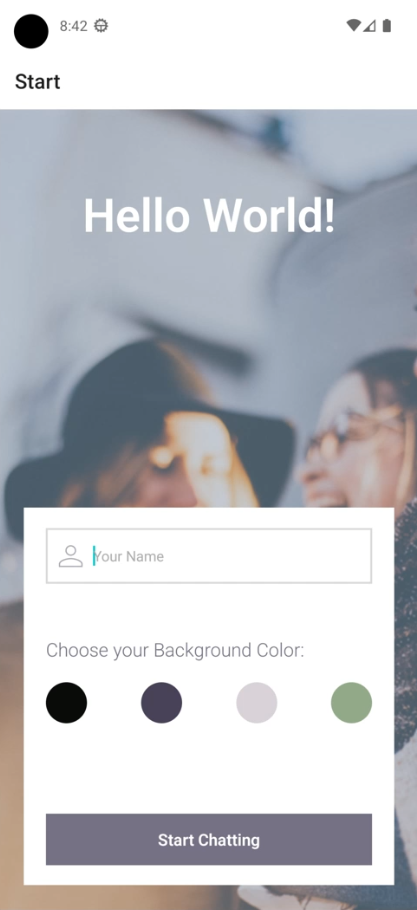
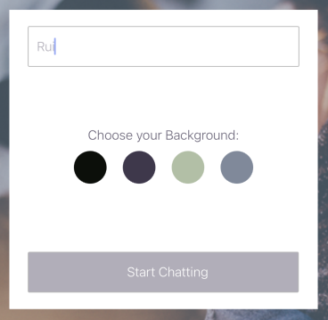
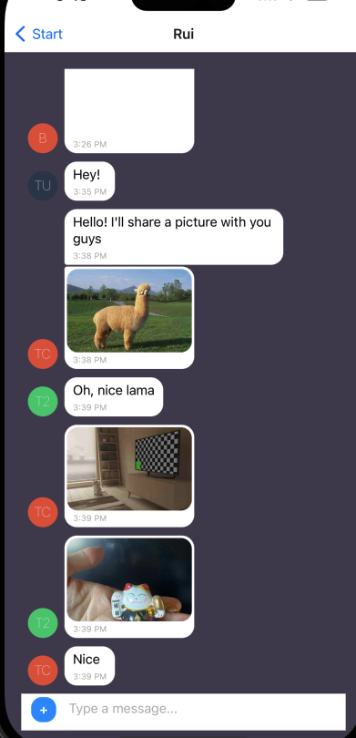
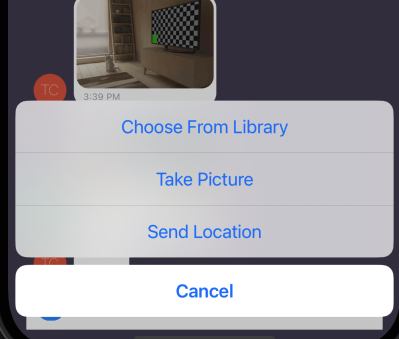
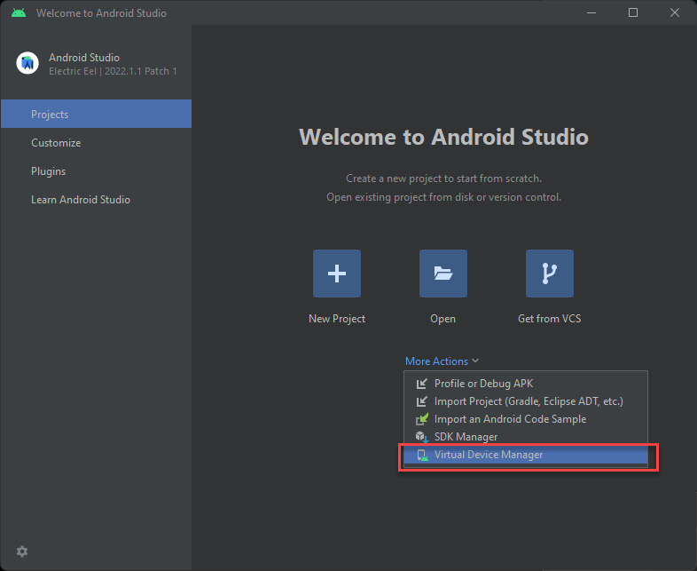

# Chat App



## Project description

A Chat App for mobile devices using React Native. The app will provide users with a chat interface and options to share images and their location.

### Key Features

- A page where users can enter their name and choose a background color for the chat screen
  before joining the chat.

- A page displaying the conversation, as well as an input field and submit button.
- The chat must provide users with two additional communication features: sending images
  and location data.
- Data gets stored online and offline.

### User Stories

- As a new user, I want to be able to easily enter a chat room so I can quickly start talking to my friends and family
- As a user, I want to be able to send messages to my friends and family members to exchange
  the latest news.
- As a user, I want to send images to my friends to show them what I’m currently doing.
- As a user, I want to share my location with my friends to show them where I am.
- As a user, I want to be able to read my messages offline so I can reread conversations at any time.
- As a user with a visual impairment, I want to use a chat app that is compatible with a screen reader so that I can engage with a chat interface.

#### Technical Dependencies

- React Native - front end framework
- Expo - native app development platform
- Android Studio - mobile development environemnt with Emulator
- Google Firebase - non-relational database for storing messages.
- Google Firestore - storage solution for media based chat messages.

## Getting Started

To get started with the application, follow these steps:

1.  Clone the repository to your local machine.
2.  Install the dependencies by running `npm install`.
3.  Start the application by running `npm start`.

#### Dependencies

The `App` component requires the following dependencies to be installed:

```json
    "@expo/webpack-config": "^18.0.1",
    "@react-native-community/masked-view": "^0.1.11",
    "@react-navigation/native-stack": "^6.9.12",
    "expo": "~48.0.9",
    "expo-status-bar": "~1.4.4",
    "firebase": "^9.13.0",
    "react": "18.2.0",
    "react-dom": "18.2.0",
    "react-native": "0.71.6",
    "react-native-gesture-handler": "~2.9.0",
    "react-native-gifted-chat": "^2.0.1",
    "react-native-reanimated": "~2.14.4",
    "react-native-safe-area-context": "4.5.0",
    "react-native-screens": "~3.20.0",
    "react-native-web": "~0.18.10",
    "react-navigation": "^4.4.4",
    "@react-native-async-storage/async-storage": "^1.17.11",
    "@react-native-community/netinfo": "^9.3.7",
    "expo-location": "~15.1.1",
    "react-native-maps": "1.3.2",
    "expo-image-picker": "~14.1.1"
```

## Usage

To use the `App` component, import it into your React Native project and include it in your app:

```
import App from './App';

export default function MyChatApp() {
return (
<App />
);
}
```

## Props

The `App` component does not accept any props.

## Components

The `App` component imports and renders two other components:

- `Start`: The start screen where the user enters their name and chooses a background color.
- `Chat`: The chat screen where the user can send and receive messages.

## Firebase Configuration

The `App` component requires a Firebase configuration object with the following properties:

```
const firebaseConfig = {
  apiKey: "<API_KEY>",
  authDomain: "<AUTH_DOMAIN>",
  projectId: "<PROJECT_ID>",
  storageBucket: "<STORAGE_BUCKET>",
  messagingSenderId: "<MESSAGING_SENDER_ID>",
  appId: "<APP_ID>"
};
```

To set up Firebase, you need to create a project in the Firebase Console, enable the Firestore and Storage services, and then copy the configuration object to your app. For more information, see the Firebase documentation.

## Network Status

The `App` component uses the `useNetInfo` hook from `@react-native-community/netinfo` to monitor changes in the network connection status. If the device loses connection, the app disables the Firestore network and displays an alert to the user.

## Stack Navigator

The `App` component uses `createStackNavigator` from `@react-navigation/stack` to set up the navigation between the `Start` and `Chat` screens.

## Firestore and Storage

The `App` component initializes the Firebase app, Firestore database, and Storage instance using the `initializeApp`, `getFirestore`, and `getStorage` functions from `firebase/app`, `firebase/firestore`, and `firebase/storage`, respectively.

## Alert and LogBox

The `App` component uses `Alert` from `react-native` to display an alert when the network connection is lost. It also uses `LogBox` from `react-native` to ignore warning messages related to AsyncStorage and Metro.

# Start.js



The Start component is the landing page of the React Native chat app. It allows the user to enter their name and choose a background color for the chat screen before joining the chat. This component uses Firebase anonymous authentication to create a new user ID for the user.

# Chat.js

=========



The Chat component is responsible for displaying the main chat screen of the application where users can send and receive messages. It contains several features such as customized bubbles, the ability to send images and location data, and it supports both online and offline messaging.

# CustomActions.js



`CustomActions.js` is a component that allows users to perform different actions within the chat interface, such as uploading an image, taking a photo, or sharing their current location.

# Testing the App

Below is a basic guide on setting up Expo and Android Studio to test the app:

1.  Install Node.js on your machine by downloading the installer from the official website and following the installation instructions.

2.  Install Expo CLI by opening a terminal or command prompt window and typing the following command:

`npm install -g expo-cli`

1.  Install Android Studio by downloading it from the official website and following the installation instructions. This will install the Android SDK and necessary dependencies.

2.  Open Android Studio and navigate to the SDK Manager. Under the "SDK Platforms" tab, make sure that the latest version of Android (currently Android 12) is installed. Under the "SDK Tools" tab, make sure that the following items are installed:

- Android SDK Build-Tools
- Android Emulator
- Android SDK Platform-Tools
- Android SDK Tools

1.  Configure the Android emulator by opening the AVD Manager in Android Studio. Create a new virtual device with the desired specifications (e.g. Pixel 4, API Level 31).



2.  Clone or download the app source code from the GitHub repository.

3.  Open a terminal or command prompt window and navigate to the app directory.

4.  Install the required dependencies by typing the following command:

`npm install`

1.  Start the Expo development server by typing the following command:

`expo start`

1.  Once the development server is running, you can use your Android emulator to test the app. Open the emulator and wait for it to fully load. Then, in the Expo development server window, click "Run on Android device/emulator" and follow the instructions to install and launch the app on the emulator.

That's it! You should now be able to test the app on your Android emulator using Expo. If you encounter any issues or errors, refer to the official Expo and Android Studio documentation for troubleshooting help.

###### [Chat app](https://afonsord.github.io/chat-bot)
